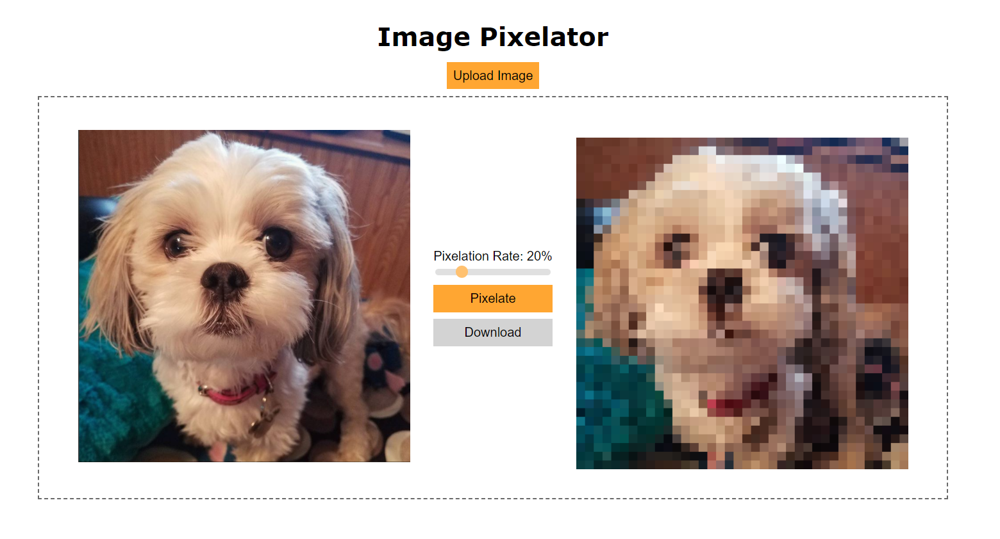

# image-pixelator
Make an image into pixel art with this simple tool.
Simply upload an image file, and once uploaded, use the slider to change how pixelated you would like the image to be. Once done, click the "pixelate" button and your pixel art should show on the right! A download button should also appear to save the image.

## Example

## Demo
Available here: [Demo](https://image-pixelator.netlify.app/)

